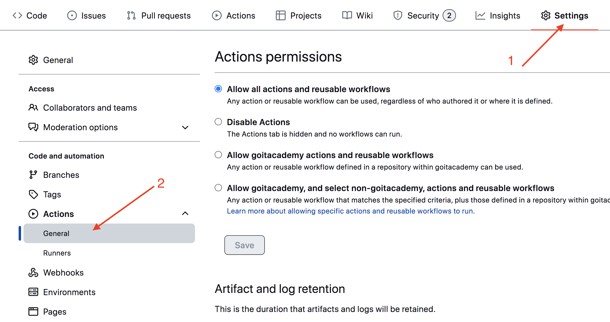

# Parcel template

Цей проєкт був створений за допомогою Parcel. Для знайомства та налаштування
додаткових можливостей [звернись до документації](https://parceljs.org/).

## Підготовка нового проєкту

1. Переконайся, що на комп'ютері встановлена LTS-версія Node.js.
   [Скачай і встанови](https://nodejs.org/en/) її, якщо необхідно.
2. Зклонуй цей репозиторій.
3. Зміни ім'я папки з `parcel-project-template` на на ім'я свого проєкту.
4. Створи новий пустий репозиторій на GitHub.
5. Відкрий проєкт в VSCode, запусти термінал и зв'яжи проєкт з
   GitHub-репозиторієм
   [по інструкції](https://docs.github.com/en/get-started/getting-started-with-git/managing-remote-repositories#changing-a-remote-repositorys-url).
6. Встанови залежності проєкту в терміналі командою `npm install` .
7. Запусти режим розробки, виконавши команду `npm start`.
8. Перейди в браузері за адресою [http://localhost:1234](http://localhost:1234).
   Ця сторінка буде автоматично перезапускатись після збереження змін в файлах
   проєкту.

## Файли и папки

- Всі паршали файлів стилей повинні лежати в папці `src/sass` і імпортуватись у
  файли стилів сторінок. Наприклад, для `index.html` файл стилей називається
  `index.scss`.
- Зображення додавай в папку `src/images`. Збірщик оптимізує їх, але тільки при
  деплої продакшн версії проєкту. Все це відбувається в хмарі, щоб не нагружати
  комп'ютер, так як на слабких машинах це може зайняти багато часу.

## Деплой

ДДля налаштування деплоя проєкту необхідно виконати декілька додаткових кроків
по налаштуванню твого репозиторію. Зайди у вкладку `Settings` і в підсекції
`Actions` обери пункт `General`.



Пролистай сторінку до останньої секції, в якій переконайся, що обрані опції як
на наступному зображенні і натисни `Save`. Без цих налаштувань у збірки буде
недостатньо прав для автоматизації процесу деплоя.


Продакшн версія проєкту буде автоматично збиратись та деплоїтисяь на GitHub
Pages, в гілку `gh-pages`, кожен раз, коли оновлюється гілка `main`. Наприклад,
після прямого пуша або прийнятого пул-реквеста. Для цього необхідно у файлі
`package.json` відредагувати поле `homepage` і скрипт `build`, замінивши
`your_username` и `your_repo_name` на свої, і відправити зміни на GitHub.

```json
"homepage": "https://your_username.github.io/your_repo_name/",
"scripts": {
  "build": "parcel build src/*.html --public-url /your_repo_name/"
},
```

Далі необхідно зайти в налаштування GitHub-репозиторія (`Settings` > `Pages`) і
виставити роздачу продакшн версії файлів з папки `/root` гілки `gh-pages`, якщо
це не було зроблено автоматично.


### Статус деплою

Статус деплою крайнього коміту відображається іконкою біля його ідентифікатора.

- **Жовтий колір** - виконується збірка і деплой проєкту.
- **Зелений колір** - деплой завершився успішно.
- **Червоний колір** - під час лінтингу, збірки або деплоя виникла помилка.

Більш детальну інформацію про статус можна переглянути, клікнувши по іконці, і в
випадаючому вікні перейти за посиланням `Details`.


### Жива сторінка

Через деякий час, зазвичай кілька хвилин, живу сторінку можна буде подивитись за
адресою, вказаною в відредагованій властивості `homepage`. Наприклад, ось
посилання на живу версію для цього репозиторію
[https://Oleg-Skrypnyk.github.io/cv-oleg_sk](https://Oleg-Skrypnyk.github.io/cv-oleg_sk).

Якщо відкривається пуста сторінка, переконайся, що у вкладці `Console` немає
помилок, пов'язаних з невірними шляхами до CSS и JS файлів проєкту (**404**).
Скоріш за все у тебе невірне значення властивості `homepage` або скрипта `build`
в файлі `package.json`.

## Як це працює


1. Після кожного пуша в гілку `main` GitHub-репозиторія, запускається
   спеціальний скрипт (GitHub Action) з файлу `.github/workflows/deploy.yml`.
2. Всі файли репозиторію копіюються на сервер, де проєкт ініціалізується і
   проходить збірку перед деплоєм.
3. Якщо всі кроки пройшли успішно, зібрана продакшн версія файлів проєкту
   відправляється в гілку `gh-pages`. В іншому випадку, в лозі виконання скрипта
   буде вказано, в чому проблема.
